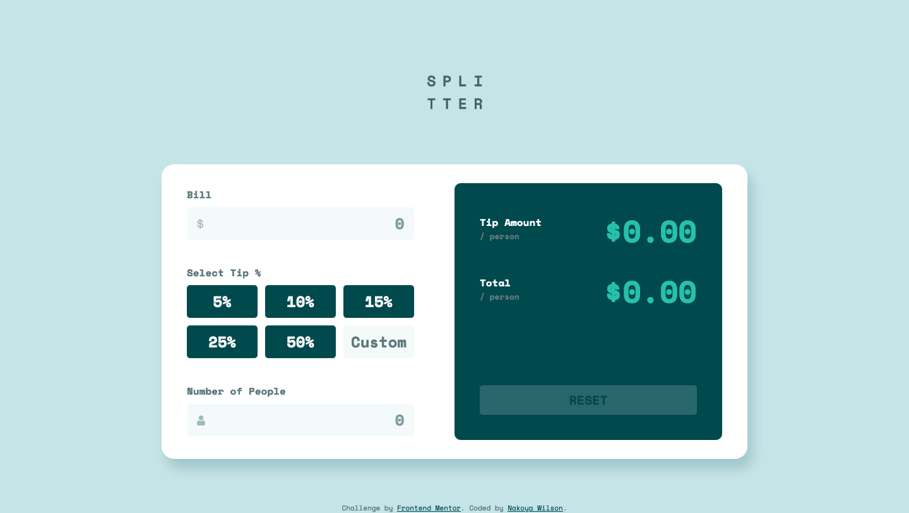

# Frontend Mentor - Tip calculator app solution

This is a solution to the [Tip calculator app challenge on Frontend Mentor](https://www.frontendmentor.io/challenges/tip-calculator-app-ugJNGbJUX). Frontend Mentor challenges help you improve your coding skills by building realistic projects.

## Table of contents

- [Overview](#overview)
  - [The challenge](#the-challenge)
  - [Screenshot](#screenshot)
  - [Links](#links)
- [My process](#my-process)
  - [Built with](#built-with)
  - [Useful resources](#useful-resources)
- [Author](#author)

**Note: Delete this note and update the table of contents based on what sections you keep.**

## Overview

### The challenge

Users should be able to:

- View the optimal layout for the app depending on their device's screen size
- See hover states for all interactive elements on the page
- Calculate the correct tip and total cost of the bill per person

### Screenshot

### Links

- Solution URL: [https://www.frontendmentor.io/solutions/tip-calculator-app-using-react-iktwdxpVn](https://www.frontendmentor.io/solutions/tip-calculator-app-using-react-iktwdxpVn)
- Live Site URL: [https://nakoyawilson-tip-calculator-app.netlify.app/](https://nakoyawilson-tip-calculator-app.netlify.app/)

## My process

### Built with

- HTML
- CSS
- Flexbox
- [React](https://reactjs.org/) - JS library

### Useful resources

- [css label width not taking effect - Stack Overflow](https://stackoverflow.com/a/10816920) - This answer helped me figure out I needed to add `display: inline-block;` on labels for the width property to take effect.
- [setState doesn't update the state immediately - Stack Overflow](https://stackoverflow.com/a/63022481) - This answer helped me figure out I needed to utilize useEffect.

## Author

- Website - [Nakoya Wilson](https://nakoyawilson.netlify.app/)
- Frontend Mentor - [@nakoyawilson](https://www.frontendmentor.io/profile/nakoyawilson)
- Twitter - [@nakoyawilson](https://twitter.com/nakoyawilson)
- LinkedIn - [@nakoyawilson](https://www.linkedin.com/in/nakoyawilson/)
